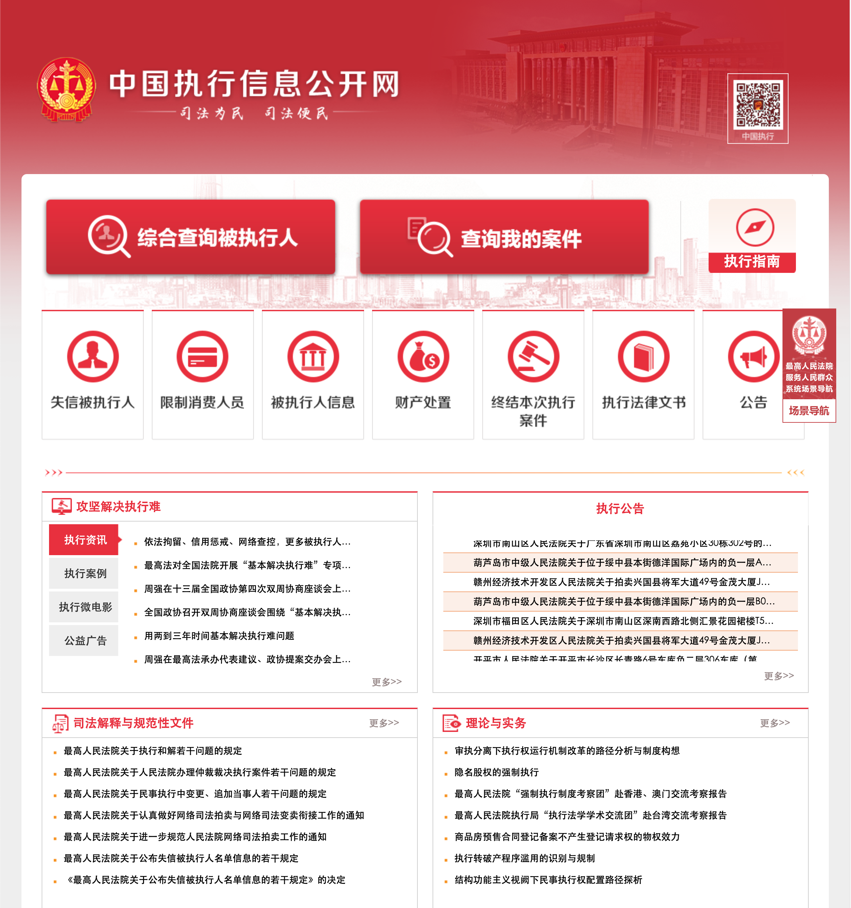
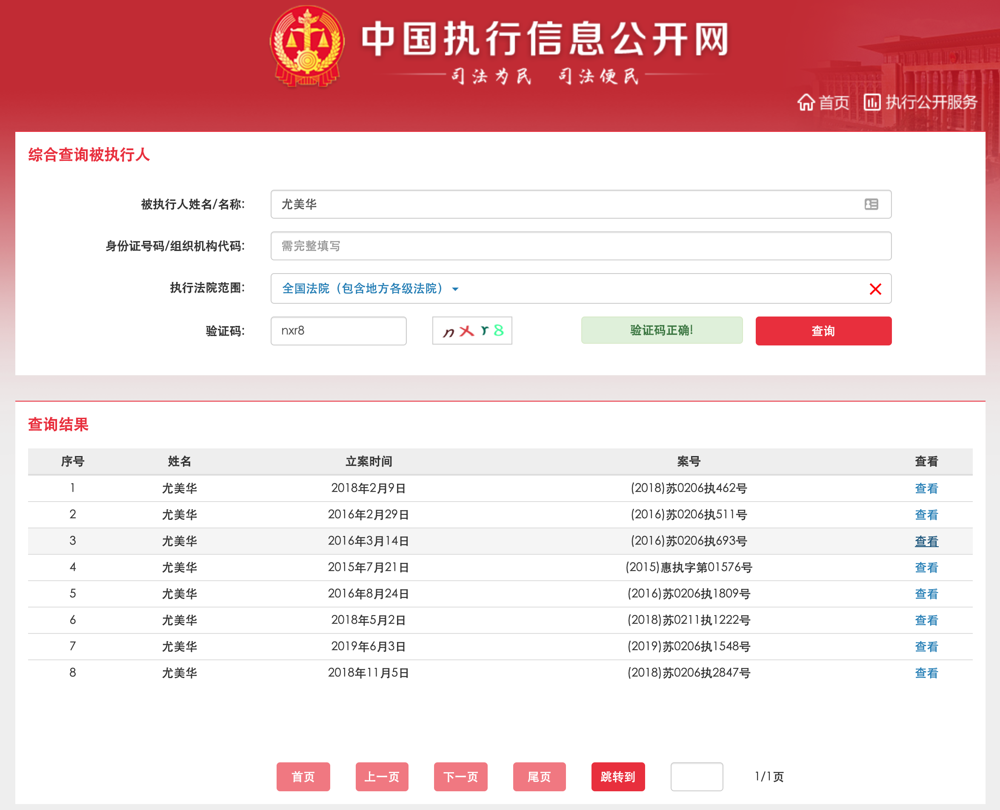
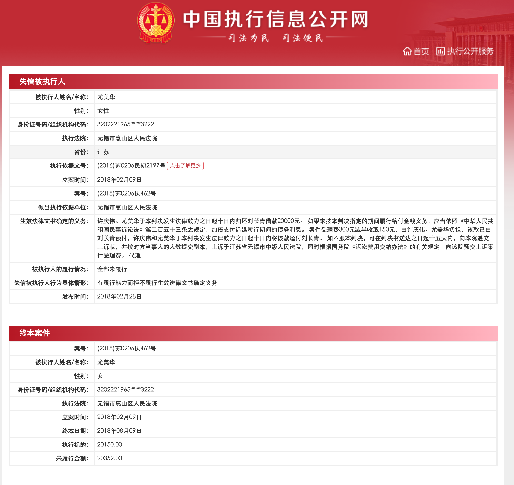
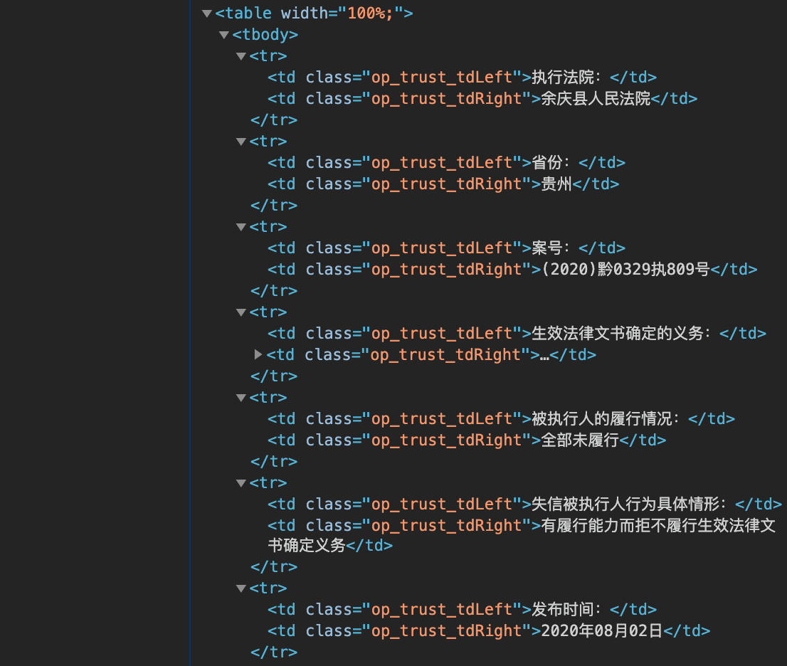

# Data Description


## Data Source

The data is obtained from http://zxgk.court.gov.cn/ $\Rightarrow$ **<u>中国执行信息公开网</u>**;

This website is hosted by the Chinese Supreme court & aimed to combine national court cases related to dishonest persons. 

website preview:


### Sample search










## Data Acquisition Method

I used programming language **<u>Python3</u>**, to scrape the website. 

Packages that I mainly used are **<u>Requests</u>** & **<u>Selenium</u>**;  

 

**<u>Requests</u>** package can access the data via API (Application programming interface) but large amount of visit within small amount of time will increase the workload/pressure of website server &  trigger the website anti-spider system. 

````python
import time
import sys
from selenium import webdriver
from selenium.webdriver.common.by import By
from selenium.webdriver.common.keys import Keys
from selenium.webdriver import ActionChains
from selenium.common.exceptions import NoSuchElementException, TimeoutException, StaleElementReferenceException
from selenium.webdriver.support import expected_conditions as EC
from selenium.webdriver.support.wait import WebDriverWait
````

 **<u>Selenium</u>** can effectively mimic human click and web browsing behavior in order not trigger the website anti-spider threshold or defense system. 

But in real practise, IPs in my IP pool was banned several times, server stopping sending me valid information and dumping me duplicated data. 


## Raw Data format

Raw data obtained from this website looks like this when accessing using <u>**Baidu API**</u>; 

```json
{
   "StdStg"           :6899,
   "StdStl"           :8,
   "_update_time"     :"1595572831",
   "cambrian_appid"   :"0",
   "changefreq"       :"always",
   "age"              :"56",
   "areaName"         :"山东",
   "areaNameNew"      :"山东",
   "businessEntity"   :"",
   "cardNum"          :"3728271963****8934",
   "caseCode"         :"(2020)鲁1323执729号",
   "courtName"        :"沂水县人民法院",
   "disruptTypeName"  :"有履行能力而拒不履行生效法律文书确定义务",
   "duty"             :"一、被告马玉存于本判决生效后5日内偿还原告山东沂水农村商业银行股份有限公司借款本金14499.99元及利息。案件受理费175元，由被告马玉存承担。",
   "focusNumber"      :"0",
   "gistId"           :"(2017)鲁1323民初4752号",
   "gistUnit"         :"沂水县人民法院",
   "iname"            :"马玉存",
   "partyTypeName"    :"0",
   "performance"      :"全部未履行",
   "performedPart"    :"暂无",
   "publishDate"      :"2020年07月21日",
   "publishDateStamp" :"1595260800",
   "regDate"          :"20200508",
   "sexy"             :"男性", 				//**this should be a spell Error on thewebsite**//
   "sitelink"         :"http://zxgk.court.gov.cn/",
   "type"             :"失信被执行人名单",
   "unperformPart"    :"暂无",
   "lastmod"          :"2020-07-24T05:02:06",
   "loc"              :"http://shixin.court.gov.cn/detail?id=710352730",
   "priority"         :"1.0",
   "SiteId"           :2015330,
   "_version"         :906,
   "_select_time"     :1595571169
}
```


Raw data obtained from the website via **<u>Selenium</u>** 



##  

## Data Storage Fomat

Data was stored in my personal machine via **<u>SQL</u>** data format to save space and for better comminication with the database.

I used **<u>MySQL</u>**  for writing/storing the data and **MySQL Workbench** for data communication/retrieving.

 


# Brief Description of Dataset


## Data Viualization


