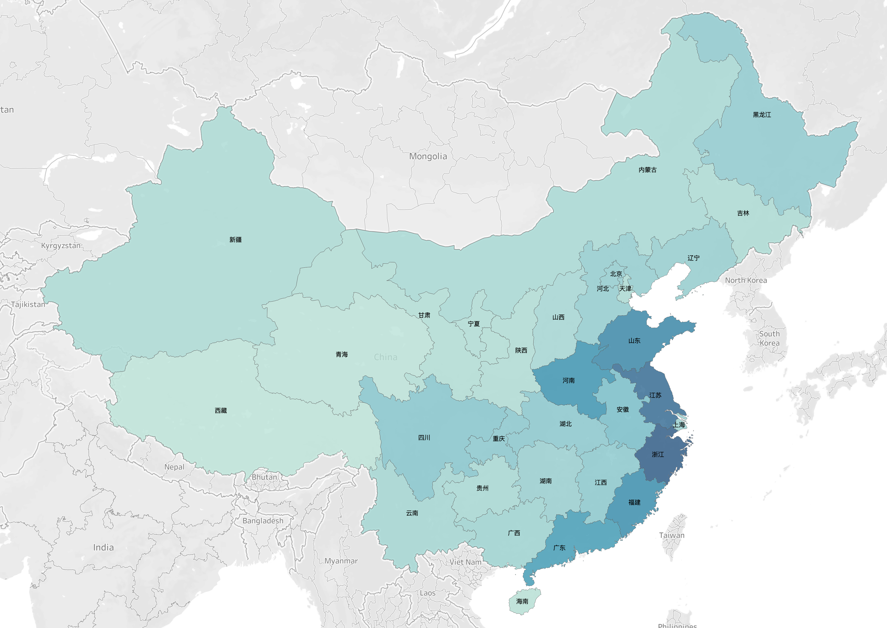
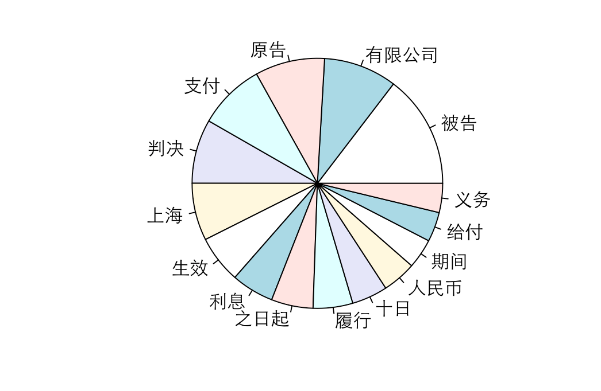
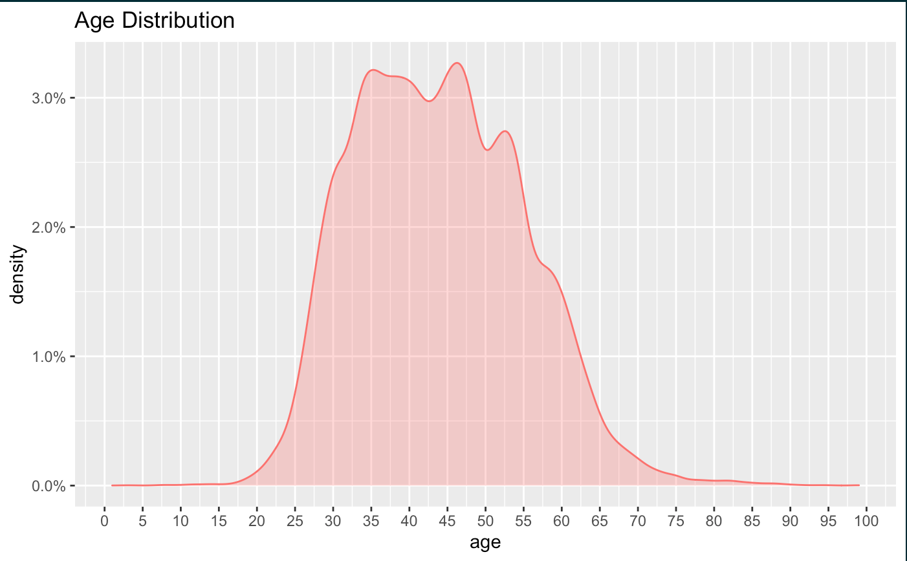
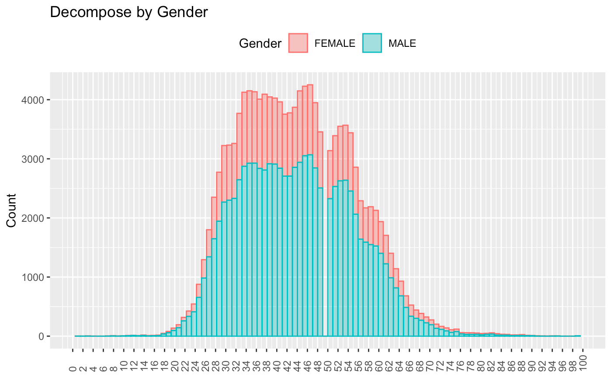
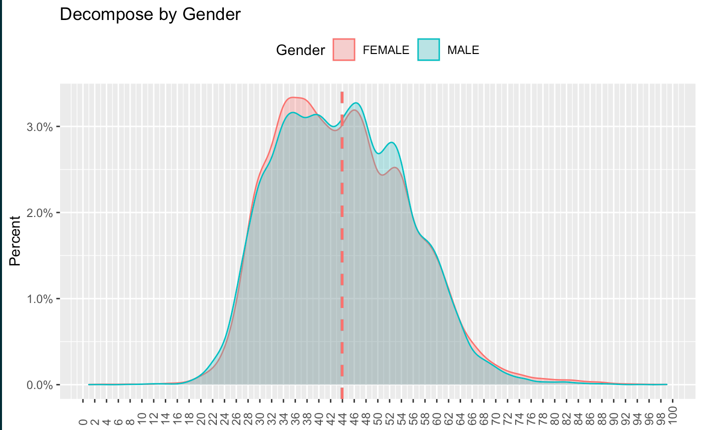
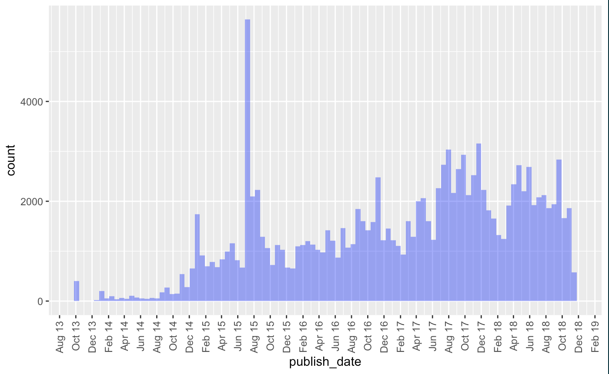
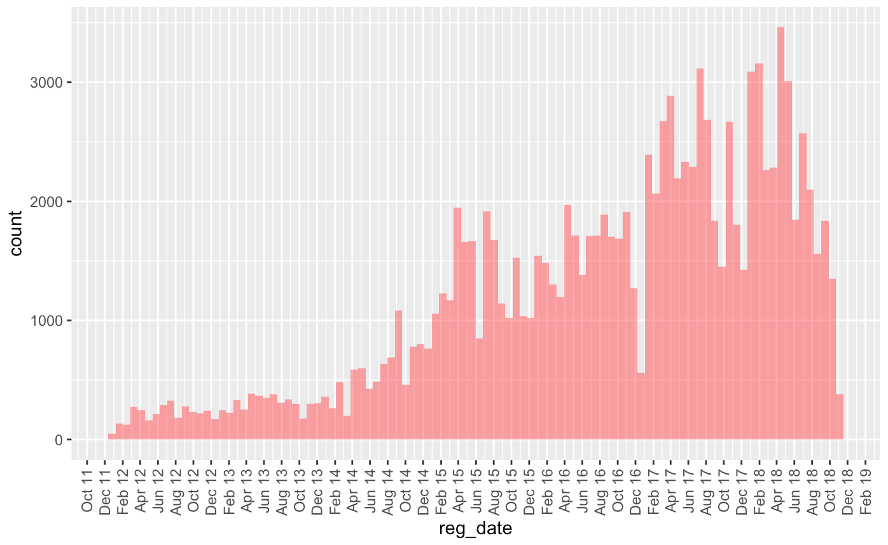

# Current Progress

## Corporation and Industry data

Another team member comes in. And I was assigned to focus more on the Corporation and Industry side of the dataset. 

here is a overview:  

## Stock Market: 
许多的上市企业但是被失信被执行或者失信被执行中：

- Media Company: 乐视 -- Status: blacklisted, delisted. 
  被 执行，退市

- Streaming Company: 熊猫直播 -- Status: CEO blacklisted, declared backruptcy  
  连带责任, 破产

Next step, take the stcok price and compare with the market performance.

## Extract dishonest records in `Shanghai`

--- 

 

### Blacklist Overview
 

 

### Extract records only contains `Shanghai`

 

 

 

 

 

 

 

 

 

 

 

 

 

